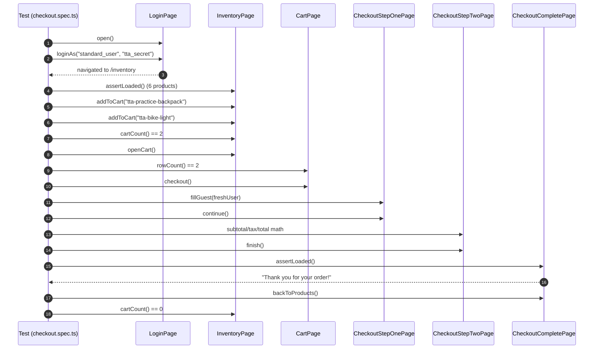
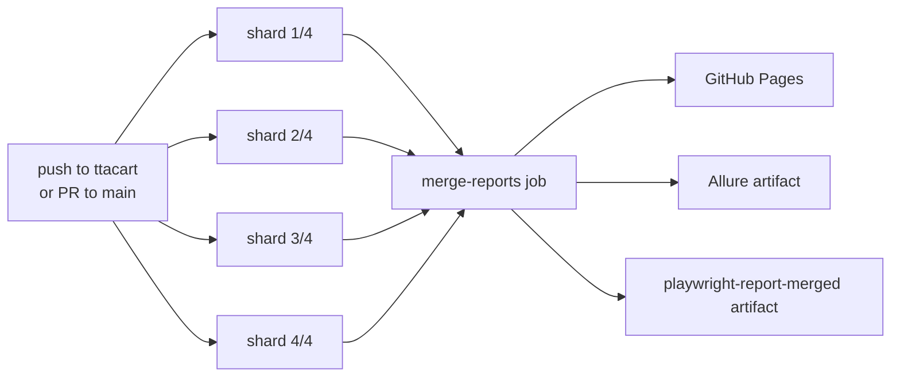
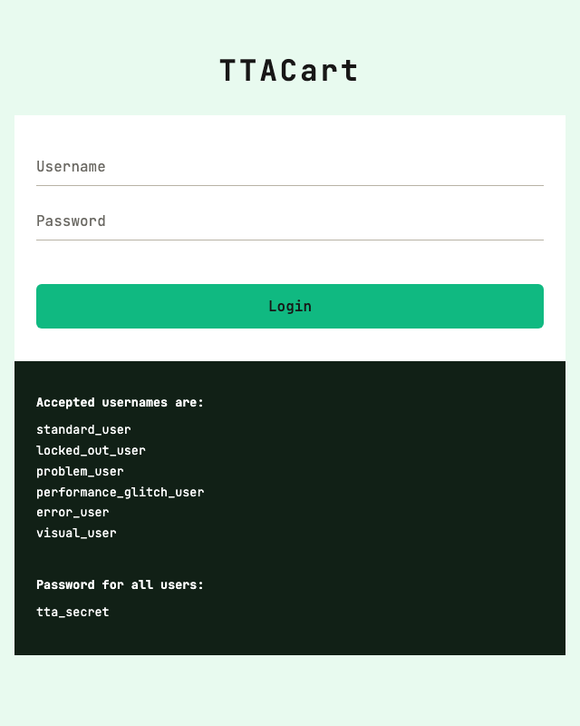
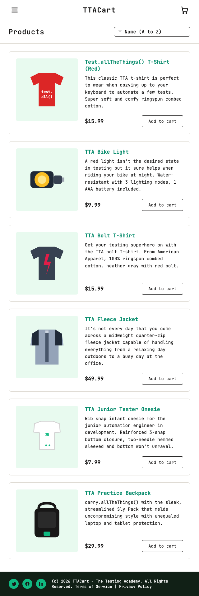
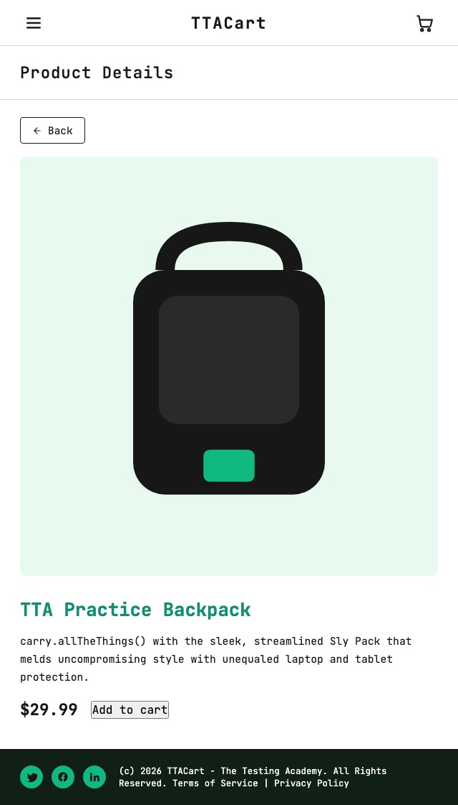
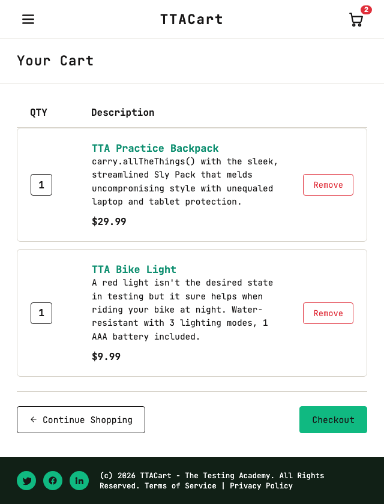
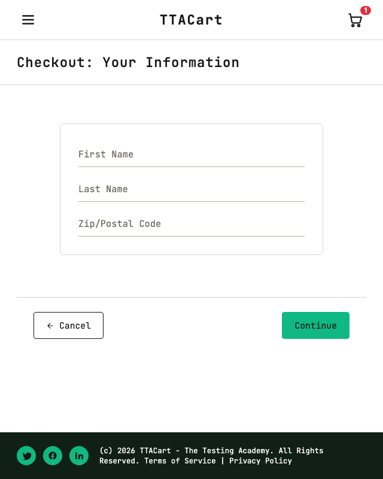
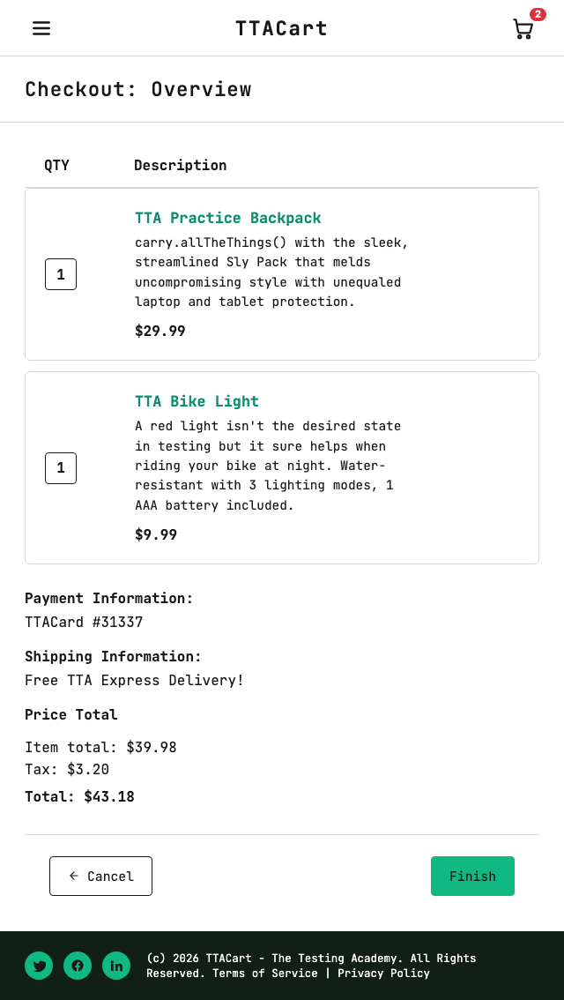
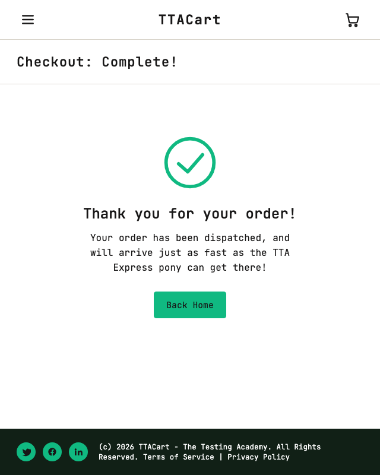

# TTACart - Playwright TypeScript suite

TTACart is the **e-commerce demo app** that ships with The Testing Academy's Advanced Playwright track. It runs at [`https://app.thetestingacademy.com/playwright/ttacart/`](https://app.thetestingacademy.com/playwright/ttacart/) and intentionally bakes in behavioural quirks (`locked_out_user`, `problem_user`, `performance_glitch_user`, ...) so students can practise writing resilient automation against a realistic SPA. This branch (`ttacart`) ships the matching end-to-end test suite: 8 typed Page Objects, 7 spec files, a custom HTML reporter, sharded CI, Allure + GitHub Pages publishing. It is the reference implementation of the 10-box architecture described on the [Advanced Framework page](https://app.thetestingacademy.com/playwright/advance-framework.html).

---

## Quick start

```bash
git clone -b ttacart https://github.com/PramodDutta/Advance-Playwright-Framework.git
cd Advance-Playwright-Framework

npm ci
npx playwright install --with-deps

# Run the whole TTACart suite against the live QA env
npx playwright test src/tests/ttacart
```

```bash
# Filter by tag
npm run test:smoke
npm run test:regression
npm run test:e2e

# Open the last HTML report
npm run report

# Generate + open Allure report
npm run report:allure
```

---

## Architecture - the 10 boxes

The framework is structured as **10 independent boxes** so each concern has one obvious home. The diagram below is rendered natively by GitHub Mermaid - no images required.

```mermaid
graph TD
    subgraph Box1[1. Page Objects]
        POM[src/pages/ttacart/*<br/>Base + 7 pages]
    end
    subgraph Box2[2. Fixtures + Specs]
        FX[src/fixtures/test-base.ts]
        SPEC[src/tests/ttacart/*.spec.ts]
    end
    subgraph Box3[3. Utils]
        UEL[UtilElementLocator]
        LOG[Logger -> logs/run-*.log]
        DF[DataFactory + Faker]
        FR[FileReader JSON/CSV/XLSX]
        DU[DateUtil]
    end
    subgraph Box4[4. Test Data]
        USERS[users.json]
        PROD[products.csv]
        T[types.ts]
    end
    subgraph Box5[5. Observability]
        CR[CustomTTAReporter -> tta-report/]
    end
    subgraph Box6[6. Config + Env]
        CFG[playwright.config.ts<br/>TTA_ENV dev/qa/stg/prod]
    end
    subgraph Box7[7. Test Execution]
        TAGS[@smoke / @regression / @e2e]
    end
    subgraph Box8[8. Reports + Artifacts]
        HTML[Playwright HTML]
        ALL[Allure]
        ART[trace + video + screenshot on fail]
    end
    subgraph Box9[9. CI/CD]
        GHA[.github/workflows/ttacart.yml<br/>4 shards + merge]
        DOCK[Dockerfile]
        CLOUD[BrowserStack / LambdaTest]
    end
    subgraph Box10[10. Quality + Package]
        PKG[package.json scripts]
        GI[.gitignore]
        TS[tsconfig.json]
    end

    POM --> FX
    FX --> SPEC
    POM --> UEL
    POM --> LOG
    SPEC --> FR
    SPEC --> DF
    FR --> USERS
    FR --> PROD
    USERS --> T
    PROD --> T
    SPEC --> TAGS
    TAGS --> CFG
    CFG --> CR
    CFG --> HTML
    CFG --> ALL
    CFG --> ART
    SPEC --> GHA
    GHA --> DOCK
    GHA --> CLOUD
    PKG --> CFG
    GI --> PKG
    TS --> PKG
```

Each box maps to exactly one folder or file:

| # | Box | Where it lives |
|---|---|---|
| 1 | Page Objects | `src/pages/ttacart/` |
| 2 | Fixtures + specs | `src/fixtures/test-base.ts`, `src/tests/ttacart/` |
| 3 | Utils | `src/utils/{UtilElementLocator,Logger,DataFactory,FileReader,DateUtil}.ts` |
| 4 | Test data | `src/testdata/ttacart/{users.json,products.csv,types.ts}` |
| 5 | Observability | `src/utils/CustomTTAReporter.ts` -> `tta-report/` |
| 6 | Config + envs | `playwright.config.ts` (TTA_ENV switcher) |
| 7 | Tags + scripts | `@smoke`, `@regression`, `@e2e` + npm scripts |
| 8 | Reports + artefacts | `playwright-report/`, `allure-results/`, traces, videos |
| 9 | CI/CD | `.github/workflows/ttacart.yml`, `Dockerfile` |
| 10 | Quality + VCS | `package.json`, `.gitignore`, `tsconfig.json` |

---

## End-to-end flow

What happens when `checkout.spec.ts` runs the full happy-path test:



---

## CI sharding

The GitHub Actions workflow fans the suite across 4 parallel shards and merges them into a single HTML report (published to GitHub Pages on the `ttacart` branch).



---

## Environments

`TTA_ENV` picks the target. `BASE_URL` always wins if set.

| TTA_ENV | Alias | Resolves to |
|---|---|---|
| `dev` | `local` | `http://localhost:3000` |
| `qa` (default) | - | `https://app.thetestingacademy.com` |
| `stg` | `stage`, `staging` | `https://stage.thetestingacademy.com` |
| `prod` | `production` | `https://app.thetestingacademy.com` |

Each branch also honours `<ENV>_BASE_URL` (e.g. `QA_BASE_URL`) so a PR preview URL can be injected without editing this file.

```bash
TTA_ENV=qa  npx playwright test src/tests/ttacart
TTA_ENV=stg npx playwright test src/tests/ttacart
QA_BASE_URL=https://pr-42.app.thetestingacademy.com npx playwright test src/tests/ttacart
```

---

## Test users

All users share the password `tta_secret`.

| Username | `kind` | Behaviour |
|---|---|---|
| `standard_user` | `ok` | Happy path - login, sort, add-to-cart, checkout all work |
| `locked_out_user` | `blocked` | Login fails with "Epic sadface: Sorry, this user has been locked out." |
| `problem_user` | `broken-ui` | Sort dropdown ignored; `firstName` auto-clears on the first checkout submit |
| `performance_glitch_user` | `slow` | Login takes ~4 seconds before navigating to inventory |
| `error_user` | `flaky` | Add-to-cart no-ops ~30% of the time - good for retry-pattern lessons |
| `visual_user` | `visual` | Cart badge and button colour drift - good for visual-regression demos |

---

## Page selector reference

Every interactive node carries a `data-test` attribute - we never use CSS classes for locators.

| Page | Path | Key `data-test` attributes |
|---|---|---|
| Login | `/playwright/ttacart/index.html` | `username`, `password`, `login-button`, `error`, `login-credentials` |
| Inventory | `/playwright/ttacart/inventory.html` | `title`, `product-sort-container`, `inventory-item`, `inventory-item-name`, `inventory-item-price`, `add-to-cart-<id>`, `remove-<id>`, `shopping-cart-badge`, `shopping-cart-link` |
| Item detail | `/playwright/ttacart/inventory-item.html?id=<id>` | `inventory-item-name`, `inventory-item-price`, `add-to-cart`, `remove`, `back-to-products` |
| Cart | `/playwright/ttacart/cart.html` | `title`, `inventory-item`, `inventory-item-name`, `continue-shopping`, `checkout`, `remove-<id>` |
| Checkout step 1 | `/playwright/ttacart/checkout-step-one.html` | `firstName`, `lastName`, `postalCode`, `continue`, `cancel`, `error` |
| Checkout step 2 | `/playwright/ttacart/checkout-step-two.html` | `subtotal-label`, `tax-label`, `total-label`, `finish`, `cancel` |
| Checkout complete | `/playwright/ttacart/checkout-complete.html` | `complete-header`, `complete-text`, `pony-express`, `back-to-products` |
| Side menu (any page) | injected globally | `open-menu`, `close-menu`, `inventory-sidebar-link`, `about-sidebar-link`, `logout-sidebar-link`, `reset-sidebar-link` |

---

## Page screenshots

Captured live against `app.thetestingacademy.com` by `scripts/capture-screenshots.ts`. Regenerate any time with:

```bash
npx ts-node scripts/capture-screenshots.ts
```

### 1. Login



### 2. Inventory (logged in as `standard_user`)



### 3. Item detail (`tta-practice-backpack`)



### 4. Cart with 2 items



### 5. Checkout step 1



### 6. Checkout step 2 (overview with totals)



### 7. Checkout complete



---

## npm scripts

| Script | What it does |
|---|---|
| `npm test` | Run every spec across every project |
| `npm run test:ttacart` | Run only the TTACart suite |
| `npm run test:smoke` | `--grep @smoke` |
| `npm run test:regression` | `--grep @regression` |
| `npm run test:e2e` | `--grep @e2e` |
| `npm run test:chromium` | Just chromium project |
| `npm run test:firefox` | Just firefox project |
| `npm run test:webkit` | Just webkit project |
| `npm run test:mobile` | Just `mobile-chrome` (Pixel 5) |
| `npm run test:shard` | Honours `SHARD=N/M`, e.g. `SHARD=2/4 npm run test:shard` |
| `npm run test:headed` | Run headed (visible browser) |
| `npm run test:ui` | Open the Playwright UI mode |
| `npm run test:debug` | Run with the inspector attached |
| `npm run report` | Open the last Playwright HTML report |
| `npm run report:allure` | Generate and open the Allure report |
| `npm run typecheck` | `tsc --noEmit` |
| `npm run lint` | ESLint over `src/**/*.ts` |
| `npm run format` | Prettier write over `src/**/*.ts` |
| `npm run clean` | Remove `dist/`, reports, results |

---

## Reports + artefacts

| Reporter | Lands in |
|---|---|
| Playwright HTML | `playwright-report/index.html` (open via `npm run report`) |
| JSON | `test-results/results.json` |
| Allure | `allure-results/` (`npm run report:allure`) |
| Custom TTA | `tta-report/report_<runId>.html` (auto-generated each run) |
| List (stdout) | streams while tests run |

On failure Playwright captures **screenshot**, **video**, and **trace** automatically (`use.screenshot: only-on-failure`, `video: retain-on-failure`, `trace: on-first-retry`).

The custom reporter (`src/utils/CustomTTAReporter.ts`) walks each test step, attaches console logs and per-step screenshots, and writes a single self-contained HTML file under `tta-report/`. The Logger also streams every action to `logs/run-<ISO>.log` for grep-after-run debugging.

---

## CI/CD + Docker + cloud

**GitHub Actions.** `.github/workflows/ttacart.yml` runs on push / PR / manual dispatch. It fans the suite 4-ways (matrix on `shard`), uploads each shard's HTML + Allure + raw `test-results/`, then a `merge-reports` job stitches them into one navigable HTML and (on `ttacart` branch) publishes to GitHub Pages.

**Docker.** Use the provided `Dockerfile`:

```bash
docker build -t ttacart-suite .
docker run --rm -e TTA_ENV=qa ttacart-suite

# Mount results back out
docker run --rm -e TTA_ENV=qa -v "$(pwd)/test-results:/app/test-results" ttacart-suite
```

**BrowserStack.** Use the official `@browserstack/playwright` runner. Sketch:

```yaml
# .browserstack.yml (committed alongside playwright.config.ts in your fork)
userName: ${BROWSERSTACK_USERNAME}
accessKey: ${BROWSERSTACK_ACCESS_KEY}
framework: playwright
platforms:
  - os: Windows
    osVersion: 11
    browserName: chrome
    browserVersion: latest
```

```bash
npx browserstack-node-sdk playwright test src/tests/ttacart
```

**LambdaTest.** With the HyperExecute config:

```yaml
# .lambdatest.yml
user: ${LT_USERNAME}
accessKey: ${LT_ACCESS_KEY}
testSuiteTimeout: 30
runson: linux
autosplit: true
retryOnFailure: true
```

```bash
lambdatest-playwright run --config lambdatest-playwright.json
```

(Cloud configs are intentionally not committed - they reference secrets. Drop them into your own fork once your `BROWSERSTACK_*` / `LT_*` env vars are in place.)

---

## How to extend - add an 8th page

The 10-box architecture is designed so adding a new screen is mechanical:

1. **Add the POM.** Create `src/pages/ttacart/MyNewPage.ts` extending `BasePage`. Declare `private readonly` locators in the constructor, expose action methods (`open()`, `submit()`, ...) and assertions (`assertLoaded()`).
2. **Export it.** Add the new class to `src/pages/ttacart/index.ts`.
3. **Wire the fixture.** In `src/fixtures/test-base.ts`, extend `TTAFixtures` with `myNewPage: MyNewPage` and add the corresponding factory inside `base.extend<TTAFixtures>({...})`.
4. **Write the spec.** Drop `src/tests/ttacart/my-new-page.spec.ts`. Import `{ test, expect }` from `../../fixtures/test-base` so you inherit the fixture. Tag tests with `@smoke` / `@regression` / `@e2e`.
5. **Add data (if needed).** New CSV/JSON belongs in `src/testdata/ttacart/`, with a matching type in `src/testdata/ttacart/types.ts`.
6. **Verify.** Run `npm run typecheck` then `npx playwright test --list src/tests/ttacart` to confirm your new spec is picked up across all 4 projects.

That's it - no central registry to update, no fragile glue code. Tests added by step 4 automatically inherit `screenshot/video/trace`, the custom reporter, sharding, and Allure.
